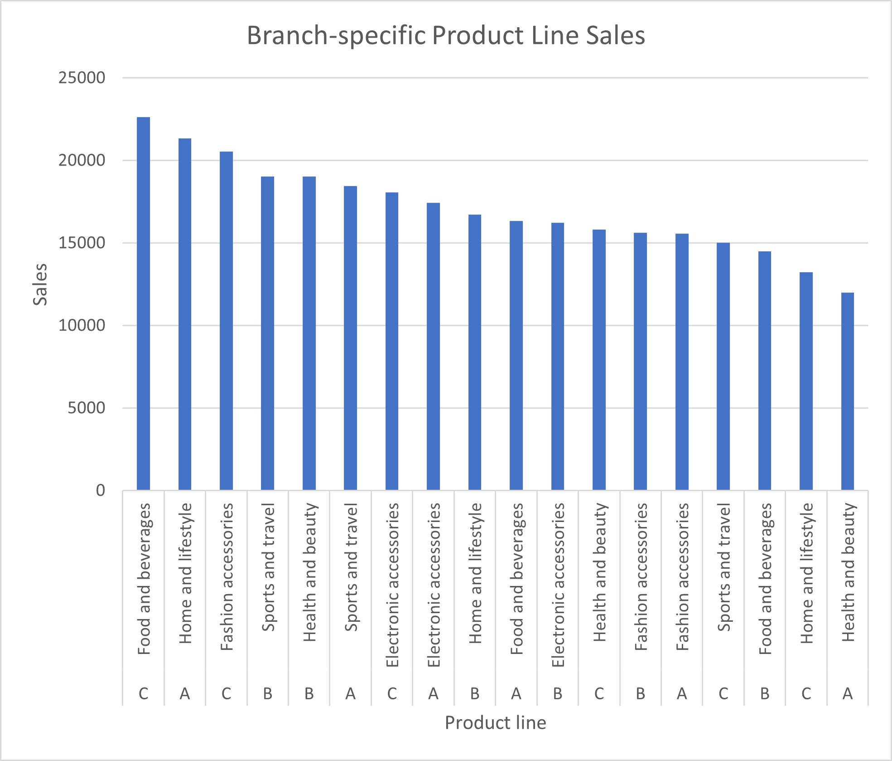

# Supermarket Sales Dataset Analysis
Data analysis on Supermarket Sales Dataset via SQL and hypothesis testing.

## Executive Summary
Analysed supermarket sales data using SQL and statistical testing to uncover branch performance, product line profitability, and customer behaviour. Findings highlight product line specialization as a stronger driver of revenue than branch location or membership programs.

## Problem Statement
The Supermarket Sales Dataset is a dataset containing 100 observations with data on customer gender, invoice ID, supermarket branch at which a sale occurred, city (supermarket location), product line, unit price, (sale) quantity, and tax. This work aims to achieve the following objectives:
1)  Determine and rank total sales for each branch.
2)  Identify and rank product lines with highest sales with respect to branch.
3)  Determine if there is a significant difference in sales between normal customers and members.
4) Determine if there are significant differences in sales between all branches.

## Methodology
- Total sales for each branch, as well as bestseller product lines for each branch, were determined and ranked using SQL.
- A **one-tailed t-test** with **5% significance level** was used to determine if there is a significant difference in sales between normal customers and members.
- **ANOVA** testing with **5% significance level** was used to determine if there are statistically significant differences in sales between all supermarket branches.

## Results
> Table 1: Total sales and taxes of each branch in descending order.

|Branch|Total Sales|Total Taxes
|:-----|:----------|:----------
|C	    |105303.50  |16047.90
|A	    |101143.20  |15224.12
|B     |101140.60	 |12640.56


> Table 2: Product lines with highest sales with respect to branch ranked in descending order.

|Branch|Product Line		      	|Total Sales|Total Taxes
|:-----|:------------------------|:----------|:----------
|C     |Food and beverages       |22635.1    |2116.05
|A     |Home and lifestyle	      |21349.71	|3668.13
|C	    |Fashion accessories      |20533.4    |4669.1
|B	    |Sports and travel        |19036.38   |1794.19
|B	    |Health and beauty        |19029.2    |2977.49
|A	    |Sports and travel        |18450.19   |3435.73
|C     |Electronic accessories   |18065.69   |2619.73
|A     |Electronic accessories   |17444.87   |1348.68
|B     |Home and lifestyle       |16713.49   |1780.84
|A     |Food and beverages       |16345.81   |1627.39
|B     |Electronic accessories   |16239.47   |2235.4
|C     |Health and beauty        |15824.12   |2189.02
|B     |Fashion accessories      |15631.73   |2248.75
|A     |Fashion accessories      |15554.77   |3418.36
|C     |Sports and travel        |15011.36   |2251.63
|B     |Food and beverages       |14490.37   |1603.89
|C     |Home and lifestyle       |13233.86   |2202.37
|A     |Health and beauty        |11997.86   |1725.83



> Figure 1: Branch-specific product line sales.


> Table 3: Mean and standard deviation for sales based on customer type.

|Customer Type|Mean  |Standard Deviation
|:------------|:-----|:-----------------
|Normal       |55.14 |26.24
|Member       |56.21 |26.71


> Table 4: ANOVA results

|         |sum_sq|df   |F     |PR(>F)
|:--------|:-----|:----|:-----|:-----
|C(Branch)|558.1 |2.0  |0.3970|0.6724
|Residual |700705|997.0|NaN   |NaN

Based on Table 1, Branch C had the highest total sales, while Branch B had the least. Furthermore, Table 2 shows that the ‘Food and beverages’ product line in Branch C had the highest sales, followed by the ‘Home and lifestyle’ product line of Branch A in 2nd place, and the ‘Fashion accessories’ product line of Branch C in 3rd place. Revenue improvement is best achieved by focusing on these three product lines. There is also the possibility of reallocation of budget for product line stocks based on their sales in each branch. For example, budget allocation for ‘Food and beverage’ can be prioritized in C but minimized in B, considering that the sales for ‘Food and beverage’ in B was ranked 16 out of 18.

Table 3 shows that members had slightly higher mean sales compared to normal customers. However, based on the one-tailed test results, **t-statistic = -0.6395** and **p-value = 0.2613**. Since the p-value obtained was above the 5% significance level, the difference in sales between normal and member customers was negligible. An assessment of membership benefits could be considered to encourage customer spending. For example, benefits could be made more attractive by introducing a more lucrative point-based system for purchases.

Table 4 shows residual variation (700,705) greatly exceeded branch variation (558), indicating that customer level differences dominate sales outcomes. Furthermore, PR(>F) had a value of 0.6724, which was larger than the 5% significance level. Hence, differences in sales between branches could be deemed random noise.

## Conclusion
-   Branch C had the highest sales, followed by A, and lastly B. Nevertheless, differences in sales were statistically insignificant.
-   Top 3 branch-specific product lines in terms of sales were ‘Food and beverages’ in Branch C, followed by ‘Home and lifestyle’ in Branch A, and ‘Fashion accessories’ in Branch C.
-   Negligible difference in sales between 'normal' and 'member' customers; limited ROI on loyalty initiatives.
-   **Strategic takeaway:** Overall, branch location or membership status are not key drivers of overall sales. Customer loyalty programmes are expected to have limited ROI unless there are major revisions. However, considering some branches produce greater sales for specific product lines, increased **branch product line specialization** could lead to improved overall sales. Weightages for the future budget of stocks in each branch can be determined based on previous year sales, which would be a good avenue for future research.


## Repository Contents
This repository contains the following files:
|File                   |Description                                                              |Objectives Fulfilled
|:----------------------|:------------------------------------------------------------------------|:--------------------
|marketQuery.sql        |SQL file containing a total of 2 queries returning results in CSV format |1,2
|supermarketAnalysis.py |Code for one-tailed t-test and ANOVA test                                |3,4

## Requirements
1. PostgreSQL 14+
2. pandas (tested with ver 2.3.1)
3. numpy (tested with ver 2.1.3)
4. statsmodels (tested with ver 0.14.6)
5. scipy (tested with ver 1.16.3)

Install Python dependencies with:
```bash
pip install pandas numpy statsmodels scipy
```

## Getting Started
1. **Download files**
   - Clone or download this repository to get the SQL and Python files.
   - Download the **Supermarket Sales Dataset** from Kaggle and save it as **'supermarket_sales_new.csv'**.
2. **Organize files**
   - Place the dataset and code files inside the same project folder (repo root).
   - Example structure:
     ```
     supermarket-sales-analysis/
     ├── README.md
     ├── marketQuery.sql
     ├── supermarketAnalysis.py
     └── supermarket_sales_new.csv
     ```
3. **Run the analysis**
   - For SQL:
     ```bash
     psql -d my_db -f marketQuery.sql
     ```
   - For Python:
     ```bash
     python supermarketAnalysis.py
     ```
4. **Check outputs**
   - SQL queries will export results as CSV files in the same folder.
   - Python scripts will generate statistical analysis outputs.

## Data Attribution
The Supermarket Sales Dataset is a dataset licensed under **CC0: Public Domain**. It is available on Kaggle at:
(https://www.kaggle.com/datasets/ismatkhan121/supermarket-sales-dataset)
